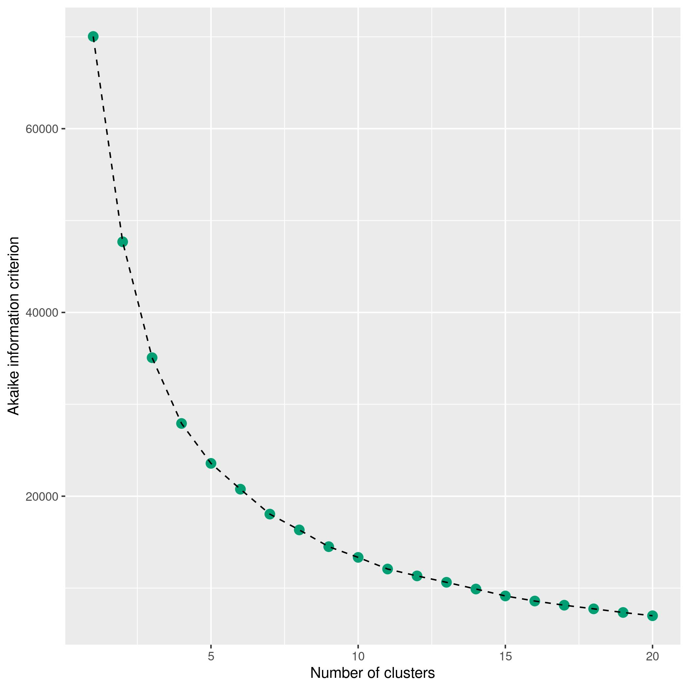
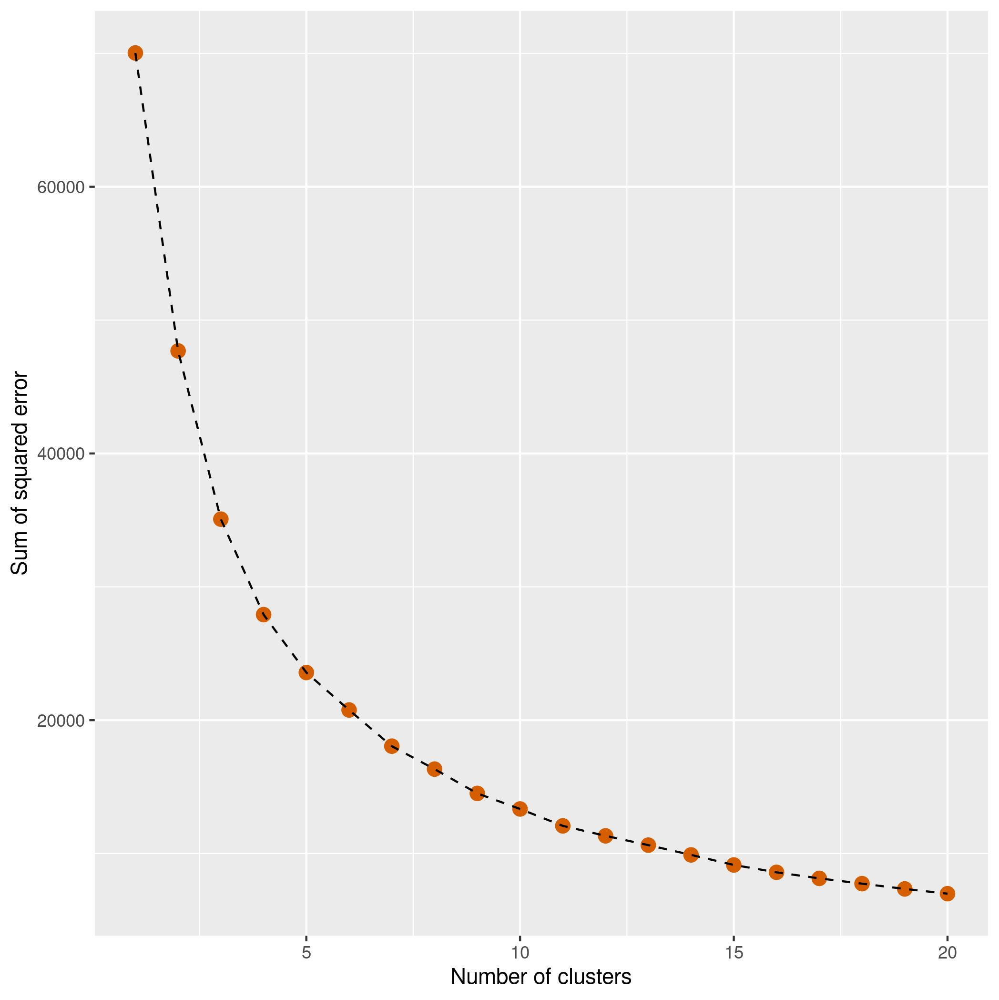
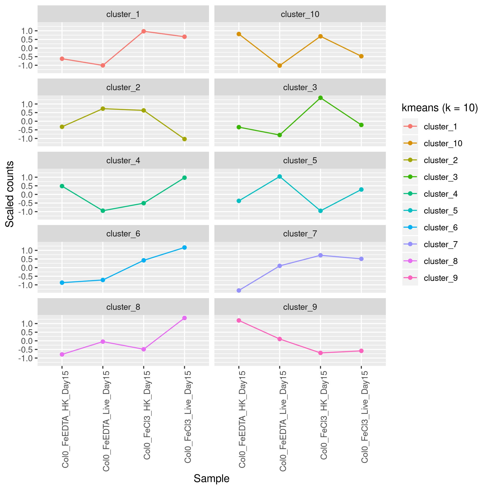
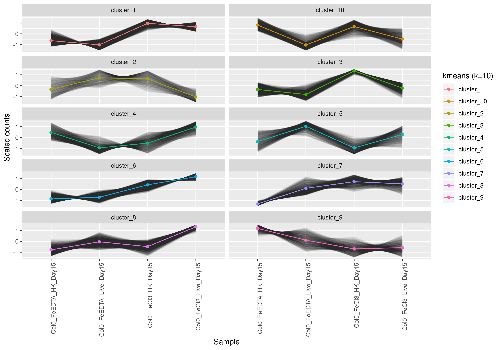
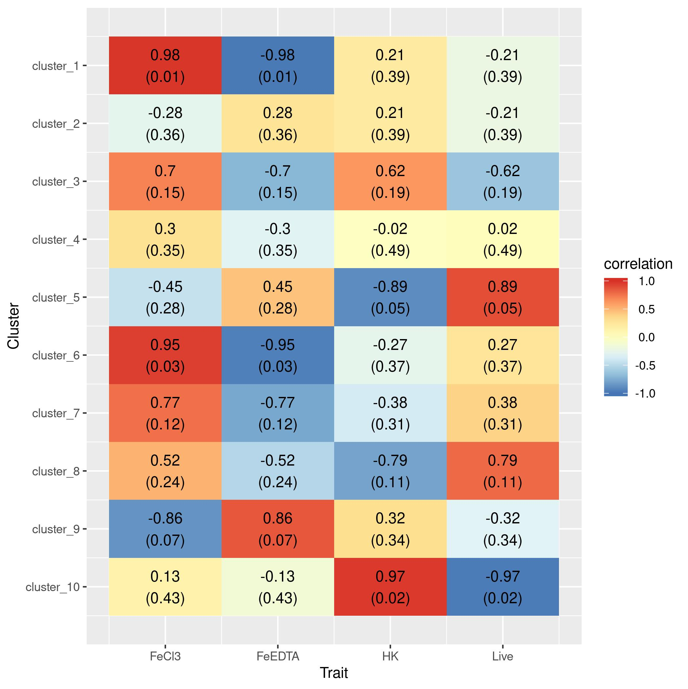

# Analysis of CJ's RNA-Seq datasets

<!-- content start -->

**Table of Contents**

- [1. Alignment](#1-alignment)
- [2. subSeq](#2-subseq)
- [3. Cluster](#3-cluster)
    - [3.1 Col0Day15](#31-col0day15)
- [4. References](#4-references)

<!-- content end -->

## 1. Alignment

| sample  | anno                        | rawfq    | trimfq   | H_ath | K_ath | 
|---------|-----------------------------|----------|----------|-------|-------| 
| 3989_AC | Col0_FeCl3_HK_Day15_Rep1    | 20620917 | 20216981 | 0.985 | 0.978 | 
| 3989_AK | Col0_FeCl3_HK_Day15_Rep2    | 20428239 | 20051155 | 0.984 | 0.975 | 
| 3989_AU | Col0_FeCl3_HK_Day15_Rep3    | 19675445 | 19277078 | 0.984 | 0.975 | 
| 3989_E  | Col0_FeCl3_HK_Day8_Rep1     | 23133429 | 22527419 | 0.986 | 0.974 | 
| 3989_M  | Col0_FeCl3_HK_Day8_Rep2     | 20872096 | 20493271 | 0.987 | 0.965 | 
| 3989_U  | Col0_FeCl3_HK_Day8_Rep3     | 20598457 | 20244361 | 0.985 | 0.968 | 
| 3989_AE | Col0_FeCl3_Live_Day15_Rep1  | 20774777 | 20401781 | 0.984 | 0.974 | 
| 3989_AM | Col0_FeCl3_Live_Day15_Rep2  | 20223530 | 19915862 | 0.983 | 0.975 | 
| 3989_AS | Col0_FeCl3_Live_Day15_Rep3  | 19075017 | 18628255 | 0.985 | 0.973 | 
| 3989_G  | Col0_FeCl3_Live_Day8_Rep1   | 21292266 | 20777831 | 0.983 | 0.971 | 
| 3989_O  | Col0_FeCl3_Live_Day8_Rep2   | 20506806 | 20175926 | 0.985 | 0.968 | 
| 3989_W  | Col0_FeCl3_Live_Day8_Rep3   | 20408559 | 20038428 | 0.985 | 0.966 | 
| 3989_Y  | Col0_FeEDTA_HK_Day15_Rep1   | 16348145 | 16042179 | 0.987 | 0.98  | 
| 3989_AG | Col0_FeEDTA_HK_Day15_Rep2   | 18471388 | 18156891 | 0.986 | 0.98  | 
| 3989_AO | Col0_FeEDTA_HK_Day15_Rep3   | 14344893 | 14056668 | 0.984 | 0.978 | 
| 3989_A  | Col0_FeEDTA_HK_Day8_Rep1    | 21237341 | 20712727 | 0.986 | 0.979 | 
| 3989_I  | Col0_FeEDTA_HK_Day8_Rep2    | 20934258 | 20464245 | 0.985 | 0.974 | 
| 3989_Q  | Col0_FeEDTA_HK_Day8_Rep3    | 20404591 | 20080694 | 0.988 | 0.975 | 
| 3989_AA | Col0_FeEDTA_Live_Day15_Rep1 | 16763102 | 16429014 | 0.984 | 0.978 | 
| 3989_AI | Col0_FeEDTA_Live_Day15_Rep2 | 15484319 | 15178626 | 0.984 | 0.977 | 
| 3989_AQ | Col0_FeEDTA_Live_Day15_Rep3 | 15460018 | 15080887 | 0.983 | 0.976 | 
| 3989_C  | Col0_FeEDTA_Live_Day8_Rep1  | 21169175 | 20630458 | 0.983 | 0.976 | 
| 3989_K  | Col0_FeEDTA_Live_Day8_Rep2  | 20395157 | 20071352 | 0.986 | 0.971 | 
| 3989_S  | Col0_FeEDTA_Live_Day8_Rep3  | 15835007 | 15469700 | 0.981 | 0.968 | 
| 3989_AD | f6h1_FeCl3_HK_Day15_Rep1    | 20462288 | 20127614 | 0.989 | 0.962 | 
| 3989_AL | f6h1_FeCl3_HK_Day15_Rep2    | 20955842 | 20679844 | 0.988 | 0.963 | 
| 3989_AT | f6h1_FeCl3_HK_Day15_Rep3    | 20169010 | 19702928 | 0.988 | 0.962 | 
| 3989_F  | f6h1_FeCl3_HK_Day8_Rep1     | 21115726 | 20522879 | 0.986 | 0.969 | 
| 3989_N  | f6h1_FeCl3_HK_Day8_Rep2     | 14549335 | 14200698 | 0.987 | 0.966 | 
| 3989_V  | f6h1_FeCl3_HK_Day8_Rep3     | 23003989 | 22438254 | 0.984 | 0.969 | 
| 3989_AF | f6h1_FeCl3_Live_Day15_Rep1  | 14663645 | 14353492 | 0.985 | 0.95  | 
| 3989_AN | f6h1_FeCl3_Live_Day15_Rep2  | 20434758 | 20119583 | 0.986 | 0.942 | 
| 3989_AV | f6h1_FeCl3_Live_Day15_Rep3  | 21040145 | 20236076 | 0.976 | 0.94  | 
| 3989_H  | f6h1_FeCl3_Live_Day8_Rep1   | 21257731 | 20791111 | 0.985 | 0.971 | 
| 3989_P  | f6h1_FeCl3_Live_Day8_Rep2   | 20977504 | 20738782 | 0.987 | 0.96  | 
| 3989_X  | f6h1_FeCl3_Live_Day8_Rep3   | 16321785 | 16000103 | 0.985 | 0.969 | 
| 3989_Z  | f6h1_FeEDTA_HK_Day15_Rep1   | 20544223 | 20179999 | 0.983 | 0.977 | 
| 3989_AH | f6h1_FeEDTA_HK_Day15_Rep2   | 14062175 | 13806131 | 0.984 | 0.978 | 
| 3989_AP | f6h1_FeEDTA_HK_Day15_Rep3   | 21038207 | 20593540 | 0.984 | 0.974 | 
| 3989_B  | f6h1_FeEDTA_HK_Day8_Rep1    | 20758910 | 20288428 | 0.985 | 0.979 | 
| 3989_J  | f6h1_FeEDTA_HK_Day8_Rep2    | 20717137 | 20159411 | 0.984 | 0.976 | 
| 3989_R  | f6h1_FeEDTA_HK_Day8_Rep3    | 20391350 | 20013443 | 0.987 | 0.974 | 
| 3989_AB | f6h1_FeEDTA_Live_Day15_Rep1 | 20709435 | 20299796 | 0.984 | 0.975 | 
| 3989_AJ | f6h1_FeEDTA_Live_Day15_Rep2 | 20903366 | 20539763 | 0.983 | 0.975 | 
| 3989_AR | f6h1_FeEDTA_Live_Day15_Rep3 | 14878972 | 14478052 | 0.986 | 0.977 | 
| 3989_D  | f6h1_FeEDTA_Live_Day8_Rep1  | 15443604 | 15160339 | 0.986 | 0.97  | 
| 3989_L  | f6h1_FeEDTA_Live_Day8_Rep2  | 20664853 | 20289917 | 0.985 | 0.966 | 
| 3989_T  | f6h1_FeEDTA_Live_Day8_Rep3  | 21278648 | 20938830 | 0.987 | 0.967 | 

## 2. subSeq

* Col0_FeCl3_HK_Day8 vs. Col0_FeCl3_Live_Day8

* Col0_FeCl3_HK_Day15 vs. Col0_FeCl3_Live_Day15

* f6h1_FeCl3_HK_Day8 vs. f6h1_FeCl3_Live_Day8

* f6h1_FeCl3_HK_Day15 vs. f6h1_FeCl3_Live_Day15

## 3. Cluster

### 3.1 Col0Day15

* AIC

* SEE

* Clusters

* Correlation matrix

## 4. References

1. Robinson DG, Storey JD: **subSeq: determining appropriate sequencing depth through efficient read subsampling.** *Bioinformatics*. 2014;30(23):3424-6.
