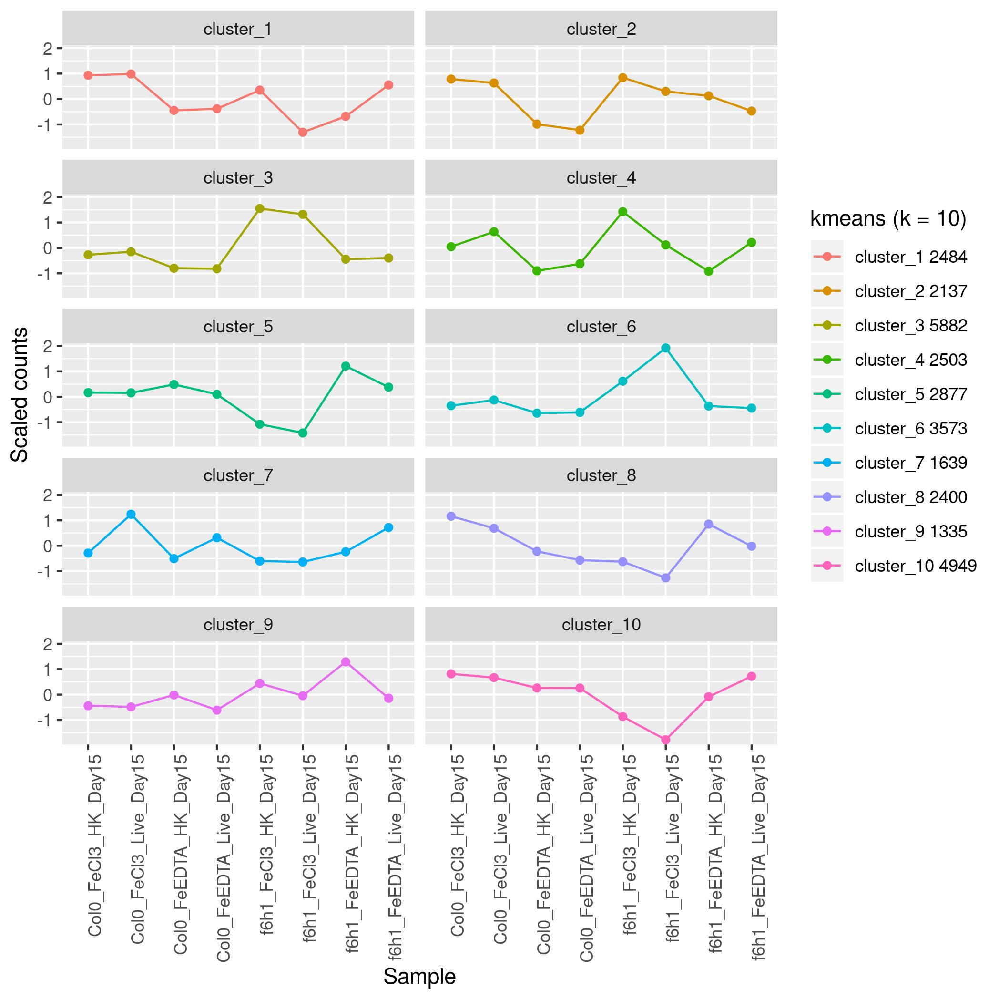
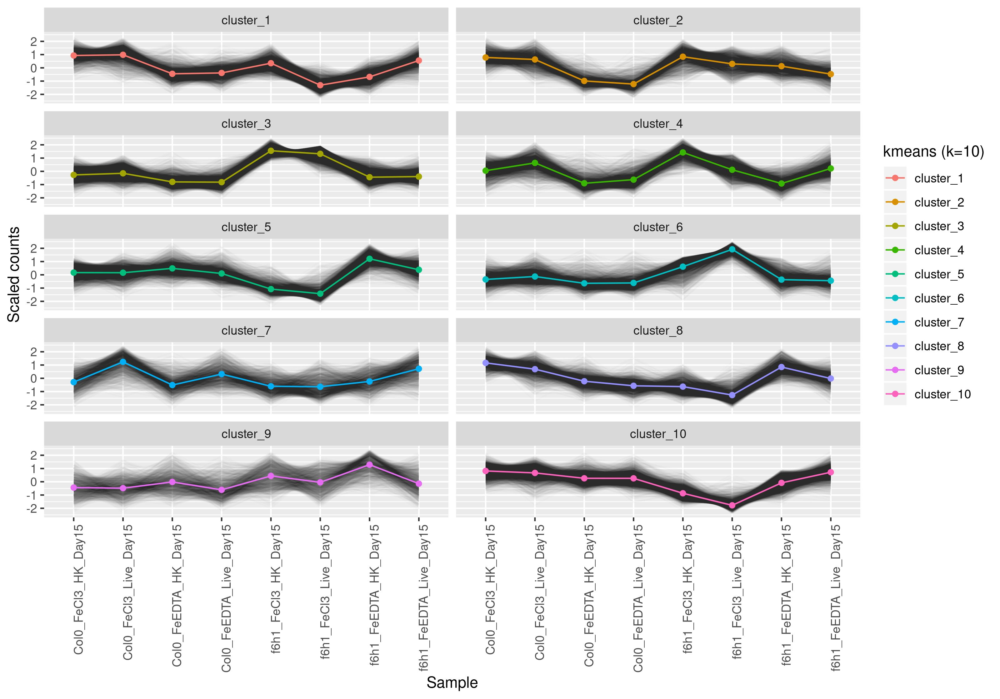
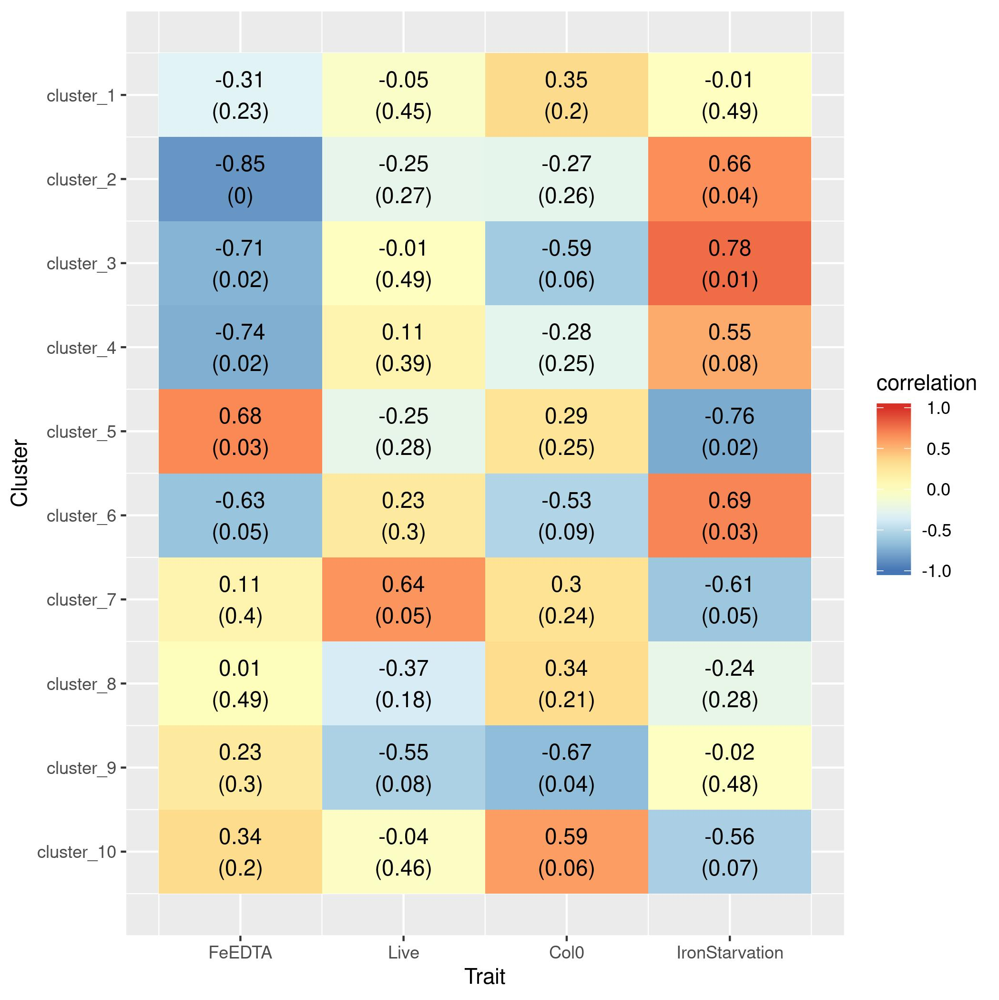

# Analysis of CJ's RNA-Seq datasets

<!-- content start -->

**Table of Contents**

- [1. Alignment](#1-alignment)
- [2. subSeq](#2-subseq)
- [3. DEGs](#3-degs)
- [4. Cluster](#4-cluster)
    - [4.1 Col0Day15](#41-col0day15)
- [5. 1stadd](#5-1stadd)
    - [5.1 Alignment](#51-alignment)
    - [5.2 DEGs](#52-degs)
- [References](#references)

<!-- content end -->

## 1. Alignment

| sample  | anno                        | rawfq    | trimfq   | H_ath | K_ath | 
|---------|-----------------------------|----------|----------|-------|-------| 
| 3989_AC | Col0_FeCl3_HK_Day15_Rep1    | 20620917 | 20216981 | 0.985 | 0.978 | 
| 3989_AK | Col0_FeCl3_HK_Day15_Rep2    | 20428239 | 20051155 | 0.984 | 0.975 | 
| 3989_AU | Col0_FeCl3_HK_Day15_Rep3    | 19675445 | 19277078 | 0.984 | 0.975 | 
| 3989_E  | Col0_FeCl3_HK_Day8_Rep1     | 23133429 | 22527419 | 0.986 | 0.974 | 
| 3989_M  | Col0_FeCl3_HK_Day8_Rep2     | 20872096 | 20493271 | 0.987 | 0.965 | 
| 3989_U  | Col0_FeCl3_HK_Day8_Rep3     | 20598457 | 20244361 | 0.985 | 0.968 | 
| 3989_AE | Col0_FeCl3_Live_Day15_Rep1  | 20774777 | 20401781 | 0.984 | 0.974 | 
| 3989_AM | Col0_FeCl3_Live_Day15_Rep2  | 20223530 | 19915862 | 0.983 | 0.975 | 
| 3989_AS | Col0_FeCl3_Live_Day15_Rep3  | 19075017 | 18628255 | 0.985 | 0.973 | 
| 3989_G  | Col0_FeCl3_Live_Day8_Rep1   | 21292266 | 20777831 | 0.983 | 0.971 | 
| 3989_O  | Col0_FeCl3_Live_Day8_Rep2   | 20506806 | 20175926 | 0.985 | 0.968 | 
| 3989_W  | Col0_FeCl3_Live_Day8_Rep3   | 20408559 | 20038428 | 0.985 | 0.966 | 
| 3989_Y  | Col0_FeEDTA_HK_Day15_Rep1   | 16348145 | 16042179 | 0.987 | 0.98  | 
| 3989_AG | Col0_FeEDTA_HK_Day15_Rep2   | 18471388 | 18156891 | 0.986 | 0.98  | 
| 3989_AO | Col0_FeEDTA_HK_Day15_Rep3   | 14344893 | 14056668 | 0.984 | 0.978 | 
| 3989_A  | Col0_FeEDTA_HK_Day8_Rep1    | 21237341 | 20712727 | 0.986 | 0.979 | 
| 3989_I  | Col0_FeEDTA_HK_Day8_Rep2    | 20934258 | 20464245 | 0.985 | 0.974 | 
| 3989_Q  | Col0_FeEDTA_HK_Day8_Rep3    | 20404591 | 20080694 | 0.988 | 0.975 | 
| 3989_AA | Col0_FeEDTA_Live_Day15_Rep1 | 16763102 | 16429014 | 0.984 | 0.978 | 
| 3989_AI | Col0_FeEDTA_Live_Day15_Rep2 | 15484319 | 15178626 | 0.984 | 0.977 | 
| 3989_AQ | Col0_FeEDTA_Live_Day15_Rep3 | 15460018 | 15080887 | 0.983 | 0.976 | 
| 3989_C  | Col0_FeEDTA_Live_Day8_Rep1  | 21169175 | 20630458 | 0.983 | 0.976 | 
| 3989_K  | Col0_FeEDTA_Live_Day8_Rep2  | 20395157 | 20071352 | 0.986 | 0.971 | 
| 3989_S  | Col0_FeEDTA_Live_Day8_Rep3  | 15835007 | 15469700 | 0.981 | 0.968 | 
| 3989_AD | f6h1_FeCl3_HK_Day15_Rep1    | 20462288 | 20127614 | 0.989 | 0.962 | 
| 3989_AL | f6h1_FeCl3_HK_Day15_Rep2    | 20955842 | 20679844 | 0.988 | 0.963 | 
| 3989_AT | f6h1_FeCl3_HK_Day15_Rep3    | 20169010 | 19702928 | 0.988 | 0.962 | 
| 3989_F  | f6h1_FeCl3_HK_Day8_Rep1     | 21115726 | 20522879 | 0.986 | 0.969 | 
| 3989_N  | f6h1_FeCl3_HK_Day8_Rep2     | 14549335 | 14200698 | 0.987 | 0.966 | 
| 3989_V  | f6h1_FeCl3_HK_Day8_Rep3     | 23003989 | 22438254 | 0.984 | 0.969 | 
| 3989_AF | f6h1_FeCl3_Live_Day15_Rep1  | 14663645 | 14353492 | 0.985 | 0.95  | 
| 3989_AN | f6h1_FeCl3_Live_Day15_Rep2  | 20434758 | 20119583 | 0.986 | 0.942 | 
| 3989_AV | f6h1_FeCl3_Live_Day15_Rep3  | 21040145 | 20236076 | 0.976 | 0.94  | 
| 3989_H  | f6h1_FeCl3_Live_Day8_Rep1   | 21257731 | 20791111 | 0.985 | 0.971 | 
| 3989_P  | f6h1_FeCl3_Live_Day8_Rep2   | 20977504 | 20738782 | 0.987 | 0.96  | 
| 3989_X  | f6h1_FeCl3_Live_Day8_Rep3   | 16321785 | 16000103 | 0.985 | 0.969 | 
| 3989_Z  | f6h1_FeEDTA_HK_Day15_Rep1   | 20544223 | 20179999 | 0.983 | 0.977 | 
| 3989_AH | f6h1_FeEDTA_HK_Day15_Rep2   | 14062175 | 13806131 | 0.984 | 0.978 | 
| 3989_AP | f6h1_FeEDTA_HK_Day15_Rep3   | 21038207 | 20593540 | 0.984 | 0.974 | 
| 3989_B  | f6h1_FeEDTA_HK_Day8_Rep1    | 20758910 | 20288428 | 0.985 | 0.979 | 
| 3989_J  | f6h1_FeEDTA_HK_Day8_Rep2    | 20717137 | 20159411 | 0.984 | 0.976 | 
| 3989_R  | f6h1_FeEDTA_HK_Day8_Rep3    | 20391350 | 20013443 | 0.987 | 0.974 | 
| 3989_AB | f6h1_FeEDTA_Live_Day15_Rep1 | 20709435 | 20299796 | 0.984 | 0.975 | 
| 3989_AJ | f6h1_FeEDTA_Live_Day15_Rep2 | 20903366 | 20539763 | 0.983 | 0.975 | 
| 3989_AR | f6h1_FeEDTA_Live_Day15_Rep3 | 14878972 | 14478052 | 0.986 | 0.977 | 
| 3989_D  | f6h1_FeEDTA_Live_Day8_Rep1  | 15443604 | 15160339 | 0.986 | 0.97  | 
| 3989_L  | f6h1_FeEDTA_Live_Day8_Rep2  | 20664853 | 20289917 | 0.985 | 0.966 | 
| 3989_T  | f6h1_FeEDTA_Live_Day8_Rep3  | 21278648 | 20938830 | 0.987 | 0.967 | 

## 2. subSeq

* Col0_FeCl3_HK_Day8 vs. Col0_FeCl3_Live_Day8


* Col0_FeCl3_HK_Day15 vs. Col0_FeCl3_Live_Day15


* f6h1_FeCl3_HK_Day8 vs. f6h1_FeCl3_Live_Day8


* f6h1_FeCl3_HK_Day15 vs. f6h1_FeCl3_Live_Day15


## 3. DEGs

* PCA plot for day 8


* PCA plot for day 15


## 4. Cluster

* Day 8


```
  FeEDTA Live Col0
1      0    0    1
2      0    1    1
3      1    0    1
4      1    1    1
5      0    0    0
6      0    1    0
7      1    0    0
8      1    1    0
```


* Day 14







## 5. 1stadd

### 5.1 Alignment

| sample  | rawfq    | trimfq   | H_ath | K_ath | 
|---------|----------|----------|-------|-------| 
| 4206_A  | 10545878 | 9823025  | 0.979 | 0.979 | 
| 4206_AA | 7032226  | 6458825  | 0.983 | 0.967 | 
| 4206_AB | 7408092  | 6893696  | 0.978 | 0.975 | 
| 4206_AC | 8156477  | 7465924  | 0.968 | 0.972 | 
| 4206_AD | 7341415  | 6789747  | 0.977 | 0.972 | 
| 4206_AE | 8578771  | 7722038  | 0.98  | 0.95  | 
| 4206_AF | 8449488  | 7761783  | 0.974 | 0.925 | 
| 4206_AG | 7238886  | 6656514  | 0.979 | 0.979 | 
| 4206_AH | 7284055  | 6713086  | 0.979 | 0.976 | 
| 4206_AI | 7769390  | 7196848  | 0.985 | 0.969 | 
| 4206_AJ | 7266881  | 6681381  | 0.977 | 0.976 | 
| 4206_AK | 7829291  | 7118148  | 0.975 | 0.963 | 
| 4206_AL | 7260684  | 6734058  | 0.977 | 0.972 | 
| 4206_AM | 8485342  | 7671561  | 0.98  | 0.958 | 
| 4206_AN | 10678288 | 9990486  | 0.963 | 0.903 | 
| 4206_AO | 8041687  | 7428025  | 0.978 | 0.978 | 
| 4206_AP | 7228988  | 6641536  | 0.978 | 0.978 | 
| 4206_AQ | 11786477 | 11119672 | 0.976 | 0.929 | 
| 4206_AR | 7623641  | 7058062  | 0.975 | 0.973 | 
| 4206_AS | 7007885  | 6386895  | 0.976 | 0.976 | 
| 4206_AT | 10532397 | 9772695  | 0.977 | 0.973 | 
| 4206_AU | 7447358  | 6965266  | 0.984 | 0.956 | 
| 4206_AV | 9469900  | 8755258  | 0.969 | 0.897 | 
| 4206_B  | 7349776  | 6742490  | 0.98  | 0.976 | 
| 4206_C  | 7126368  | 6579298  | 0.981 | 0.973 | 
| 4206_D  | 10045145 | 9183211  | 0.979 | 0.976 | 
| 4206_E  | 8514191  | 7728495  | 0.976 | 0.979 | 
| 4206_F  | 7441682  | 6869019  | 0.98  | 0.974 | 
| 4206_G  | 8482112  | 7786383  | 0.981 | 0.96  | 
| 4206_H  | 7315283  | 6833868  | 0.979 | 0.97  | 
| 4206_I  | 7352204  | 6760403  | 0.98  | 0.979 | 
| 4206_J  | 7382597  | 6784569  | 0.98  | 0.976 | 
| 4206_K  | 9769334  | 8984428  | 0.979 | 0.976 | 
| 4206_L  | 7285673  | 6769844  | 0.977 | 0.975 | 
| 4206_M  | 9647239  | 8780060  | 0.974 | 0.977 | 
| 4206_N  | 7582281  | 6935833  | 0.977 | 0.974 | 
| 4206_O  | 7386843  | 6782673  | 0.981 | 0.969 | 
| 4206_P  | 7482498  | 6937942  | 0.98  | 0.967 | 
| 4206_Q  | 7205748  | 6622084  | 0.979 | 0.976 | 
| 4206_R  | 7030789  | 6462875  | 0.976 | 0.976 | 
| 4206_S  | 7182892  | 6609494  | 0.98  | 0.975 | 
| 4206_T  | 8091139  | 7187791  | 0.972 | 0.973 | 
| 4206_U  | 7849039  | 7159694  | 0.979 | 0.975 | 
| 4206_V  | 9856067  | 9098018  | 0.979 | 0.973 | 
| 4206_W  | 10167014 | 9398733  | 0.982 | 0.97  | 
| 4206_X  | 7338569  | 6779606  | 0.982 | 0.957 | 
| 4206_Y  | 7901756  | 7293296  | 0.974 | 0.974 | 
| 4206_Z  | 7517436  | 6833111  | 0.973 | 0.973 | 

### 5.2 DEGs

* PCA plot for day 8


* PCA plot for day 14


### 5.3 Clusters

* Day 8


```
  FeEDTA Live Col0
1      0    0    1
2      0    1    1
3      1    0    1
4      1    1    1
5      0    0    0
6      0    1    0
7      1    0    0
8      1    1    0
```


* Day 14


## References

1. Robinson DG, Storey JD: **subSeq: determining appropriate sequencing depth through efficient read subsampling.** *Bioinformatics*. 2014;30(23):3424-6.

